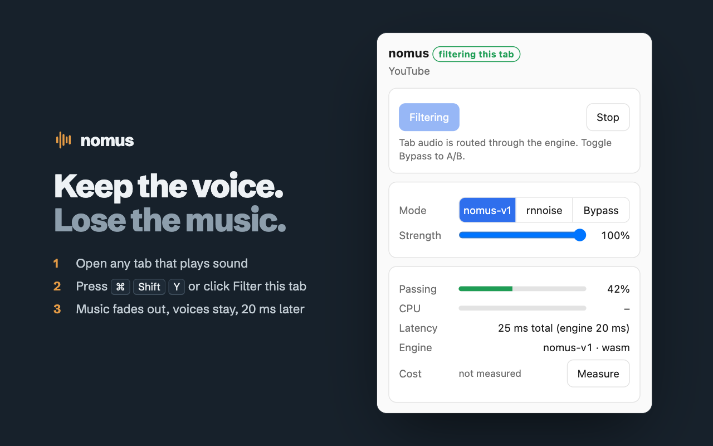

<p align="center">
  
</p>

<h1 align="center">nomus</h1>

<p align="center">
  <b>Keep the voice. Lose the music.</b><br />
  A Chrome extension that removes background music from any tab in real time and keeps voices, including singing.
</p>

<p align="center">
  <a href="https://chromewebstore.google.com/detail/enmkngmoakghoclllgkmoehngicaoafn?utm_source=website">Chrome Web Store</a> ·
  <a href="https://agrohi.com/nomus/">Website</a> ·
  <a href="https://agrohi.com/nomus/demo/">Try the demo</a> ·
  <a href="https://agrohi.com/nomus/privacy/">Privacy</a>
</p>

<p align="center">
  
</p>

## Install

Install **[nomus from the Chrome Web Store](https://chromewebstore.google.com/detail/enmkngmoakghoclllgkmoehngicaoafn?utm_source=website)**.
It's free, needs no account, and updates itself.

1. Pin nomus from the puzzle-piece menu in Chrome's toolbar.
2. Open a tab that plays sound: a video, a lecture or a podcast.
3. Click **Filter this tab**, or press <kbd>⌘</kbd> <kbd>Shift</kbd> <kbd>Y</kbd> on a Mac (<kbd>Ctrl</kbd> <kbd>Shift</kbd> <kbd>Y</kbd> elsewhere).
   Press it again to hear the original.

## How it works

```
tab audio ──tabCapture──▶ offscreen document ──▶ AudioWorklet ──▶ WASM engine ──▶ speakers
                                                  (10 ms frames, 20 ms total delay)
```

- **Capture.** Chrome hands nomus the audio of the one tab you chose. Nothing is captured until you start filtering.
- **Filtering.** A small neural network, compiled to WebAssembly, runs on the real-time audio thread. It decides,
  frequency by frequency, what is voice and what is instruments.
- **On your computer only.** There is no nomus server. The engine is built with no imports, so it cannot reach the
  network or the disk. The extension's CSP (`connect-src 'self'`) blocks outgoing requests.
- **Controls.** The popup lets you A/B between the trained model (`nomus-v1`), an RNNoise baseline and Bypass. It
  also shows a strength slider and live voice, latency and CPU readouts.

**Check it yourself.** Start filtering a tab. Then open `chrome://extensions`, turn on Developer mode, and click
the *offscreen.html* link next to *Inspect views* on the nomus card. Pick the Network tab. While the tab plays, the
list stays empty.

## Repository layout

```
extension/            the unpacked extension, identical to the Web Store build
  manifest.json       MV3 manifest: tabCapture, offscreen, activeTab, storage
  background.js       service worker: toolbar action, shortcut, badge, offscreen lifecycle
  offscreen.js        capture and audio graph (runs in the offscreen document)
  worklet.js          AudioWorkletProcessor hosting the WASM engine
  popup.*             the popup UI
  bench.js            main-thread engine benchmark (the audio thread has no precise clock)
  pkg/                compiled engine and model weights (see below)
  tests/              node:test tests (offscreen capture lifecycle, rate prompt)
docs/                 logo and images
```

### About `extension/pkg/`

The engine (Rust) and the model training pipeline are not open source. This repository ships their compiled
output so the extension runs as-is:

| File | What it is | Licence | SHA-256 |
| --- | --- | --- | --- |
| `nomus_wasm.wasm` | Compiled audio engine, WebAssembly with SIMD and zero imports | Proprietary, see [LICENSE](LICENSE) | `9b8d4ea44a99319a451a9dd1ab5488828166f85bab5b2da072e3ee5f2c5b4cd9` |
| `model.nmv` | Trained voice-mask weights (vocal12, NMV3) | [CC BY-NC-SA 4.0](https://creativecommons.org/licenses/by-nc-sa/4.0/) | `9d97a25bbd1d33d60af9bdf035c973f383b88156a48e346174451a49e8c3264f` |

The model is trained partly on GTSinger, which is licensed CC BY-NC-SA 4.0, so the weights carry the same licence.
Dataset credits are in [extension/CREDITS.txt](extension/CREDITS.txt).

## Develop

**Run from source**

1. Go to `chrome://extensions` and enable **Developer mode**.
2. Click **Load unpacked** and choose the `extension/` folder.
3. After you edit a file, click the reload icon on the nomus card.

Chrome 116 or newer is required.

**Tests** (Node 18 or newer):

```bash
node --test extension/tests/*.test.cjs
```

**Package for the Web Store.** This builds a zip without the tests:

```bash
./scripts/package.sh
```

Tab capture needs a real click or keystroke on the extension. Chrome rejects synthetic input from automation, so the
capture step itself can't be tested automatically.

## Limitations

- **Platform:** this extension runs in Chrome on a computer. Apps for macOS, Linux and Android are on the
  [download page](https://agrohi.com/nomus/download/).
- **What can be filtered:** only the active tab, and never browser pages such as `chrome://`.
- **Very loud music:** when the music is much louder than the voice, some of it comes through.
- **Voice-like instruments:** instruments that sound like a voice, such as a solo violin, can pass.

## Support

- **Questions and bugs:** [open an issue](https://github.com/by-sabbir/nomus-extension/issues), write to
  [support@agrohi.com](mailto:support@agrohi.com), or see the [support page](https://agrohi.com/nomus/support/).
- **Reviews:** leave one on the [Chrome Web Store](https://chromewebstore.google.com/detail/enmkngmoakghoclllgkmoehngicaoafn?utm_source=website).

## License

The extension source is under the [MIT licence](LICENSE). In `extension/pkg/`, the compiled engine `nomus_wasm.wasm` is
proprietary and the model weights `model.nmv` are under [CC BY-NC-SA 4.0](https://creativecommons.org/licenses/by-nc-sa/4.0/).
See [LICENSE](LICENSE) and [extension/CREDITS.txt](extension/CREDITS.txt).
